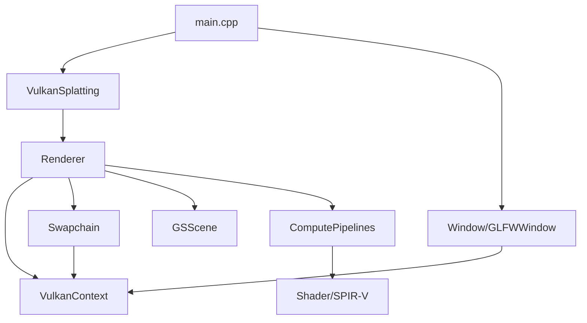
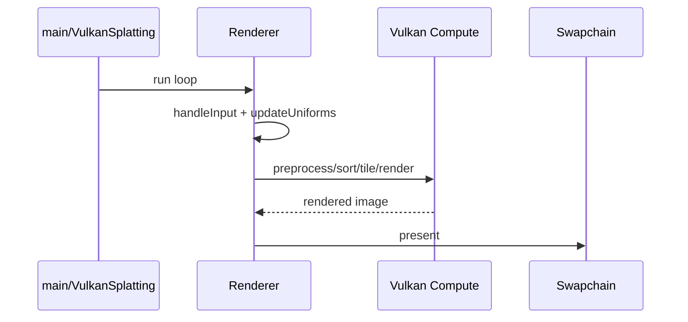

# 3DGS.cpp 设计框架说明

## 1. 项目定位

本仓库实现基于 Vulkan 计算着色器管线的 3D Gaussian Splatting（3DGS）实时查看器：从 PLY 场景读入高斯参数，在 GPU 上做预处理、排序与分块光栅化，并输出到交换链显示。桌面入口在 `apps/viewer`，核心逻辑位于静态库 `3dgs_cpp`。

## 2. 分层架构（自顶向下）

| 层次 | 主要职责 | 代表类型 / 文件 |
|------|----------|-----------------|
| 应用入口 | 解析命令行与环境变量、校验资源、组装配置、创建窗口、驱动生命周期 | `apps/viewer/main.cpp` |
| 门面层 | 对外 API：创建窗口、`start` / `initialize` / `draw` / `stop` | `VulkanSplatting`（`include/3dgs/3dgs.h`，`src/3dgs.cpp`） |
| 渲染编排 | Vulkan 初始化、场景上传、计算管线搭建、每帧录制与提交、输入与 GUI、交换链重建 | `Renderer`（`src/Renderer.h`、`src/Renderer.cpp`） |
| Vulkan 上下文 | Instance、物理/逻辑设备、队列族、Surface、VMA、命令池、描述符池、时间戳 Query | `VulkanContext`（`src/vulkan/VulkanContext.h`、`src/vulkan/VulkanContext.cpp`） |
| 平台与呈现 | Surface、尺寸与输入抽象；Swapchain 与 Image | `Window` / `GLFWWindow`、`Swapchain` |
| 数据与着色器 | PLY 解析、GPU Buffer；SPIR-V 嵌入头文件 | `GSScene`、`ComputePipeline`、`src/shaders/` |

## 3. 入口流程（`apps/viewer/main.cpp`）

1. 使用 `args` 解析 CLI：场景路径、validation layers、物理设备索引、immediate swapchain、分辨率、`--no-gui` 等。
2. 使用 `libenvpp`（前缀 `VKGS`）读取环境变量，并合并到 `RendererConfiguration`（CLI 优先）。
3. 校验场景文件存在，配置日志级别（`spdlog`）。
4. 调用 `VulkanSplatting::createGlfwWindow(...)` 创建窗口并注入配置。
5. 构造 `VulkanSplatting(config)`，调用 `start()` 启动渲染。

## 4. 门面层：`VulkanSplatting`

- `RendererConfiguration` 封装运行时关键参数：校验层、设备 ID、交换链模式、场景路径、相机参数、GUI 开关、窗口对象。
- `start()` 内部执行：
  - 创建 `Renderer`
  - `renderer->initialize()`
  - `renderer->run()`
- 还提供 `initialize()`、`draw()`、`stop()`，便于嵌入式或外部循环驱动。

## 5. Vulkan 核心：`VulkanContext`

`VulkanContext` 是设备与资源级基础设施层，不承担 3DGS 业务逻辑。

### 核心职责

- 创建并持有 `vk::Instance`。
- 选择物理设备（可按索引，也可自动选择，优先独显）。
- 创建逻辑设备与队列（Graphics / Compute / Present）。
- 创建 VMA 分配器、命令池、描述符池、时间戳查询池。
- 提供一次性命令缓冲工具：
  - `beginOneTimeCommandBuffer()`
  - `endOneTimeCommandBuffer(...)`

### 关键设计点

- 使用 Vulkan-Hpp RAII（`vk::Unique*`）管理资源生命周期。
- 支持校验层与 debug callback，对接 `spdlog`。
- 设备扩展中注入 dynamic rendering，并按平台处理差异（如 Apple portability/MoltenVK）。

## 6. 渲染编排：`Renderer`

`Renderer` 负责算法和每帧执行顺序，是项目最核心的流程控制器。

### 初始化主链路（`initialize()`）

```text
initializeVulkan
 -> createGui
 -> loadSceneToGPU
 -> createPreprocessPipeline
 -> createPrefixSumPipeline
 -> createRadixSortPipeline
 -> createPreprocessSortPipeline
 -> createTileBoundaryPipeline
 -> createRenderPipeline
 -> createCommandPool
 -> recordPreprocessCommandBuffer
```

### `initializeVulkan()` 的关键步骤

1. 从 `Window` 获取实例扩展并创建 `VulkanContext`。
2. 创建 Vulkan instance。
3. 通过 `Window::createSurface` 建立 surface，并选择物理设备。
4. 申请所需特性（如 `shaderInt64`、`shaderStorageImageWriteWithoutFormat` 等）创建逻辑设备。
5. 创建描述符池、交换链、同步对象（fence/semaphore）。

### 渲染数据与管线

- `GSScene` 负责读取 PLY，生成并上传场景 buffer（顶点、高斯协方差等）。
- 多条 compute pipeline 负责预处理、前缀和、基数排序、tile 边界计算与最终渲染。
- 每帧更新 uniform（相机、投影、分辨率），录制并提交命令，最后 present。
- GUI 开启时，结合 query pool 时间戳显示性能指标。

### 输入与交互

- 相机由位置 + 四元数旋转表示。
- `handleInput()` 从 `Window` 获取鼠标和按键状态，处理旋转/平移和 GUI 捕获冲突。

### 交换链重建

- 当窗口尺寸变化时触发 `recreateSwapchain()`。
- 重新计算 tile 相关缓冲区，重录部分命令并重建渲染管线。

## 7. 模块关系图



## 8. 一帧执行概览



## 9. 维护建议阅读顺序

1. `apps/viewer/main.cpp`
2. `include/3dgs/3dgs.h` + `src/3dgs.cpp`
3. `src/Renderer.h` + `src/Renderer.cpp`
4. `src/vulkan/VulkanContext.h` + `src/vulkan/VulkanContext.cpp`
5. `src/GSScene.h` 及 `src/vulkan/pipelines/`、`src/shaders/`

---

该文档聚焦整体框架与职责边界，便于新成员快速建立“入口-编排-平台-算法”四层认知。
